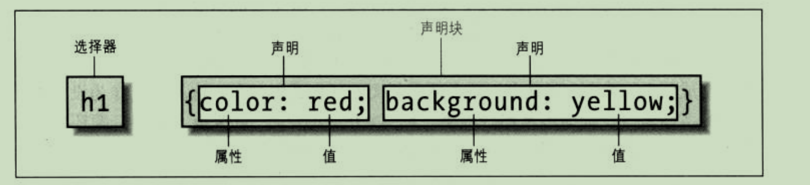

# CSS权威指南笔记
## 选择器
### css语法


### 元素选择器
```
h1 {color: gray;}
```
### 选择器分组
```
h1, p {color: gray;}
```
### 通配选择器
```
* {color: red;}
```

### 声明分组
```
h1 {
  font: 18px Helvetica;
  color: purple;
  background: aqua;
}
```

### 结合选择器和声明分组
```
hl, h2, h3, h4, h5, h6 {color: gray; background: white; padding: 0.5em;
border: lpx solid black; font-family: Charcoal, sans-serif;}
```

### 类选择器和ID选择器
#### 类选择器
```
*.warning { font-weight: bold; }
```
匹配class属性包含warning的所有p元素
```
p.warning { font-weight: bold; }
```
#### 多类选择器

```
<p class="urgent warning"> hello world </p>
```

```
.warning { font-weight: bold;}
.urgent { font-style: italic; }
.warning.urgent { bcakground: silver; }
```
#### ID选择器
```
<p id="lead-para"> hello world </> 
```

```
#lead-para { font-weight: bold; }
```
id选择器只能应用于一个元素，如果多个元素有相同的id会出错

### 属性选择器
#### 简单属性选择器

```
<h1 class="hoopla"> hello </h1>
<h1 class="severe"> world </h1>
```

选择有class属性(值不限)的所有h1元素
```
h1[class] { color: silver; }
```
可以根据多个属性进行选择
```
a[href][title] { font-weight: bold; }
```
第一个链接变粗体，第二个和第3个不变
```
<a href="http://www.w3.org/" title="W3C Home">W3C</a><br />
<a href="http://www.webstandards.org">Standards Info</a><br />
<a title="Not a link">dead.letter</a>
```

#### 根据具体属性值选择
假设想将指向 Web 服务器上某个特定文档的超链接变成粗体，可以写作:
```
a[href="http://www.css-discuss,org/about .html"] (font-weight: bold;}
```
